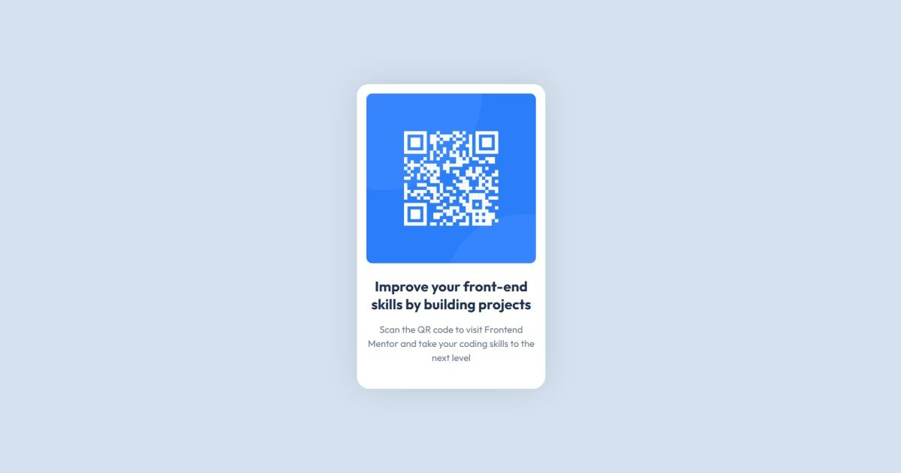

# 📁 QR Code Component

## ℹ️ QR Code Component Website

A responsive QR code component website built using HTML and CSS during my third month of learning frontend development. This challenge was completed via [Frontend Mentor](https://www.frontendmentor.io/challenges/qr-code-component-iux_sIO_H), based on a provided Figma file and style guide.

---

## 🔍 Overview

This project recreates a clean, centered QR code component based on a Frontend Mentor design challenge. It focuses purely on layout, visual hierarchy, and responsive design using semantic HTML5 and modern CSS practices.

It was built during my third month of learning frontend web development and highlights how small components can still teach essential layout, spacing, and typography skills.

---

## ✨ Features

- Fully responsive layout centered with Flexbox
- Semantic HTML structure
- Mobile-first design approach
- Clean and accessible markup
- Visual design matched from provided Figma & style guide
- Custom CSS variables for colors, font, and spacing

---

## 🧠 What I Learned

- How to center elements vertically and horizontally using Flexbox
- Using CSS variables to create a maintainable color and spacing system
- Structuring a component layout with semantic tags like `<main>` and `<section>`
- Setting up project meta tags including Open Graph and Twitter cards
- Naming conventions and class structuring for readability

---

## 🛠️ Tech Used

- HTML5
- CSS3

---

## 🚀 How to Run

1. Clone the repository
2. Navigate to this project folder
3. Open `index.html` in your browser

---

## 🌐 Live Demo

Or you can check out the 👉 [live website here](https://qr-code-component-fm-jiro.netlify.app/)

---

## 🧑‍💻 Author

Created by **Elmar Chavez**

🗓️ Month/Year: **June 2025**

📚 Journey: **3rd** month of learning _frontend web development_.
